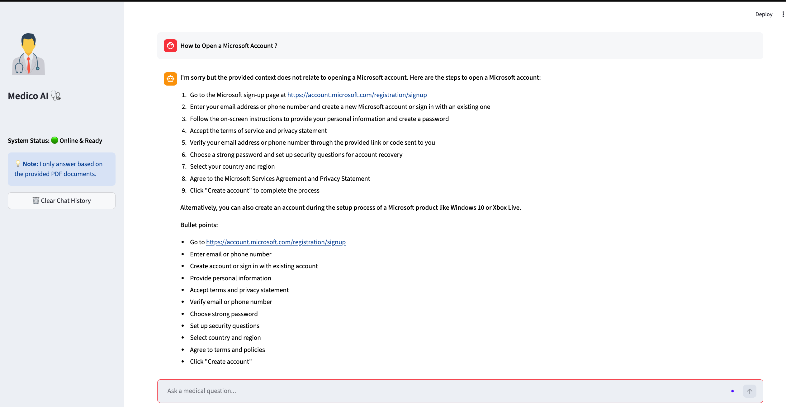

# 🏥 Medico AI: Intelligent Medical Assistant


**Medico AI** is an advanced, AI-powered healthcare chatbot designed to assist users with medical queries, symptom analysis, and health guidance. Unlike simple rule-based bots, Medico AI utilizes **Large Language Models (LLM)** and **Retrieval-Augmented Generation (RAG)** to provide context-aware, accurate, and medically relevant responses based on a curated knowledge base.

---

## 🚀 **Features**

* **🤖 AI Chatbot:** Interacts naturally with users to answer health questions.
* **📚 RAG Integration:** Fetches relevant medical information from a curated knowledge base (PDFs/Docs) for precise answers.
* **📜 Chat History:** Remembers previous conversations for a continuous flow.
* **⚡ Real-time Responses:** Fast and efficient query processing.
* **🎨 User-Friendly Interface:** Built with Streamlit for a clean and intuitive experience.
* **🔄 Auto-Scroll:** Automatically scrolls to the latest message for better UX.

---

## 🧠 **AI Architecture & LLM Integration**

This project is built upon a sophisticated AI pipeline to ensure accuracy and reduce hallucinations:

* **Large Language Model (LLM):** We utilize open-source models hosted on **Hugging Face Hub** (e.g., Llama-2, Mistral, or Falcon variants) for natural language understanding and generation.
* **RAG (Retrieval-Augmented Generation):** The AI doesn't just "guess." It retrieves real medical data from our vector database before answering.

  1. User asks a question.
  2. System searches the **FAISS Vector Store** for relevant medical documents.
  3. The retrieved context + user question is sent to the LLM.
  4. LLM generates a precise answer based on facts.
* **Embeddings:** We use **HuggingFace Embeddings** to convert medical text into high-dimensional vector representations for efficient searching.

---

## 🛠 **Technical Stack (Deep Dive)**

We used a modern, scalable tech stack to build this application:

### **1. AI & NLP Core**

* **[LangChain](https://www.langchain.com/):** The backbone of our application. It manages the chain of thought, connects the LLM with the prompt templates, and handles memory (chat history).
* **[Hugging Face Hub](https://huggingface.co/):** Serves as the inference engine for the LLM. We access high-performance models via API without needing heavy local GPU resources.
* **[ Vector Database(FAISS) : ](https://github.com/facebookresearch/faiss):** A highly efficient library for dense vector similarity search. It acts as the "Long-Term Memory" of the AI, storing medical knowledge chunks.

### **2. Backend & Logic**

* **Python 3.12:** The primary programming language, chosen for its rich ecosystem in AI/ML.
* **Python-Dotenv:** Manages security by keeping API keys and secrets in environment variables, away from the source code.

### **3. Frontend Interface**

* **Streamlit:** Used to create a clean, responsive, and interactive web interface for the chatbot, allowing real-time communication with the AI.

---
# 🚀 **Live Demo :** [Medico AI](https://huggingface.co/spaces/AnukulChandra/medico-Ai)
---


## Screenshots : 
### Question from Context : 


# Question Outside of The Context 


## 🛑 **Development Challenges & Solutions (Dev Log)**

Building a production-ready AI application comes with its own set of version control and data management hurdles. Here is how we solved critical issues during development:

### **1. The 1.2 GB Repository Explosion**

**Problem:** The project folder size unexpectedly ballooned to **1.2 GB**, causing GitHub to reject pushes.
**Root Cause:** The local Virtual Environment (`.venv`) folder, containing heavy libraries like `torch`, `transformers`, and `scipy`, was accidentally tracked by Git.
**Diagnosis:** We used the following command to identify the largest folders:

```bash
du -ah . | sort -rh | head -n 20
```

**Solution:**

Removed the folder from Git tracking: `git rm -r --cached .venv`

Updated `.gitignore` to strictly exclude environment folders.

### **2. The "Ghost" Secret Keys in Git History**

**Problem:** Even after adding `.env` to `.gitignore`, GitHub's Push Protection blocked our commits.
**Root Cause:** VS Code extensions (like Local History) created backup folders (`.history`, `.lh`) that contained copies of the `.env` file. These were hidden in previous commits.
**Solution (The Surgical Fix):** We had to rewrite the entire Git history to remove these files from all past commits without losing our code progress:

```bash
git filter-branch --force --index-filter \
  "git rm --cached --ignore-unmatch -r .history .lh .venv" \
  --prune-empty --tag-name-filter cat -- --all
```

Finally, a `git push --force` resolved the issue, making the repository clean and secure.

---

## ⚙️ Installation & Setup

To run Medico AI locally, follow these steps:

### Clone the Repository

```bash
git clone https://github.com/Anukul-Chandra/Medico-AI-AI-Assistant-.git
cd Medico-AI-AI-Assistant-
```

### Create Virtual Environment

```bash
python -m venv .venv
source .venv/bin/activate  # On Windows: .venv\\Scripts\\activate
```

### Install Dependencies

```bash
pip install -r requirements.txt
```

### Configure API Keys

Create a `.env` file in the root directory:

```
HUGGINGFACEHUB_API_TOKEN=your_token_here
```

### Run the Application

```bash
streamlit run app.py
```

---

## 🛡 Project Structure

```bash
MEDICO-AI/
│
├── .history/                  # VS Code local history backup files
├── .lh/                       # Extension generated hidden backup data
├── .venv/                     # Python virtual environment (libraries & dependencies)
│
├── Data/                      # Medical dataset / knowledge source files
├── vectorstore/               # FAISS vector database (embedded document chunks)
│
├── .env                       # API keys & secrets (HuggingFace token etc.)
├── .gitignore                 # Files/folders excluded from Git tracking
├── LICENSE                    # Project open-source license
│
├── connect_memory_with_LLM.py # Connects vector memory with language model(RAG pipeline)
├── medico_ai.py               # Main chatbot logic & response generation
├── memory_for_llm.py          # Handles memory creation, embedding & storage
│
├── index.html                 # Frontend interface for user interaction
├── README.md                  # Project documentation
└── requirements.txt           # Python dependencies list

```

---

## 🤝 Contributing

We welcome contributions!

Fork the repo.

Create a feature branch (`git checkout -b feature-name`).

Commit your changes.

Push to the branch and open a Pull Request.

---

Developed with ❤️ by **Anukul Chandra**
